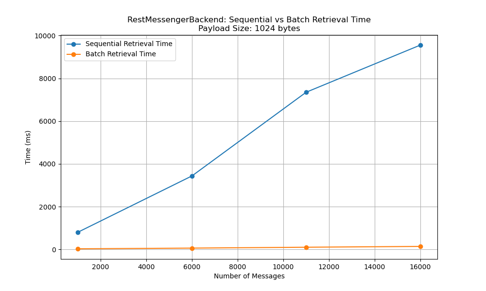
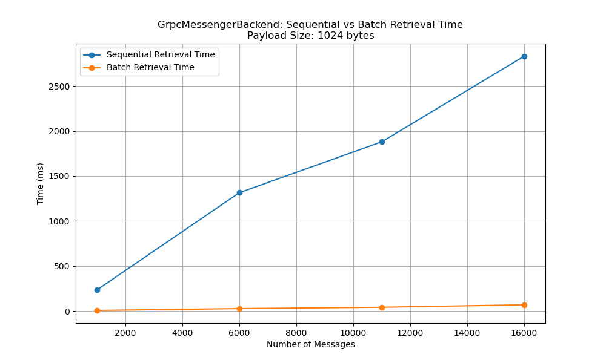
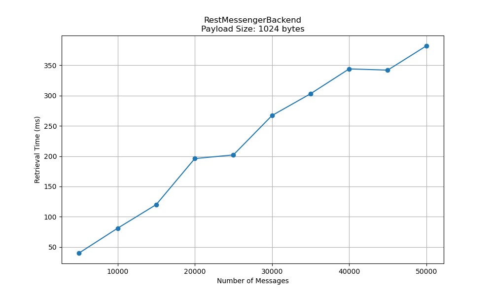
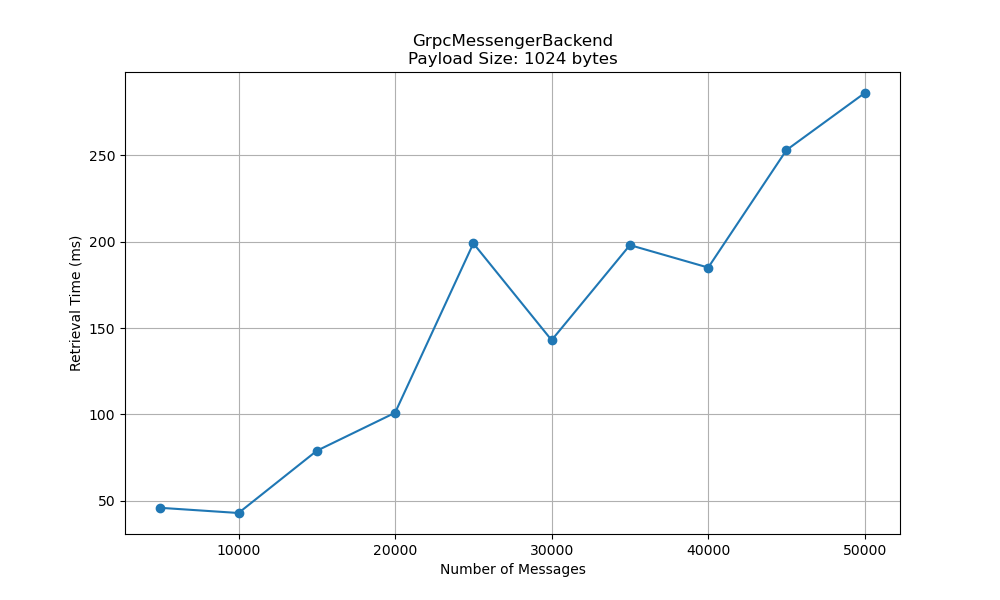
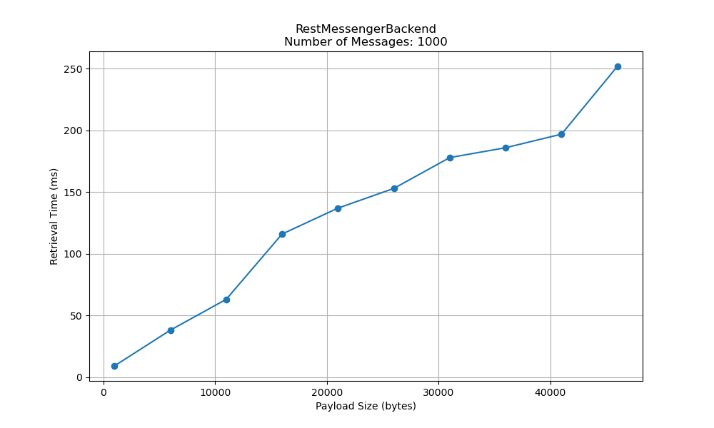
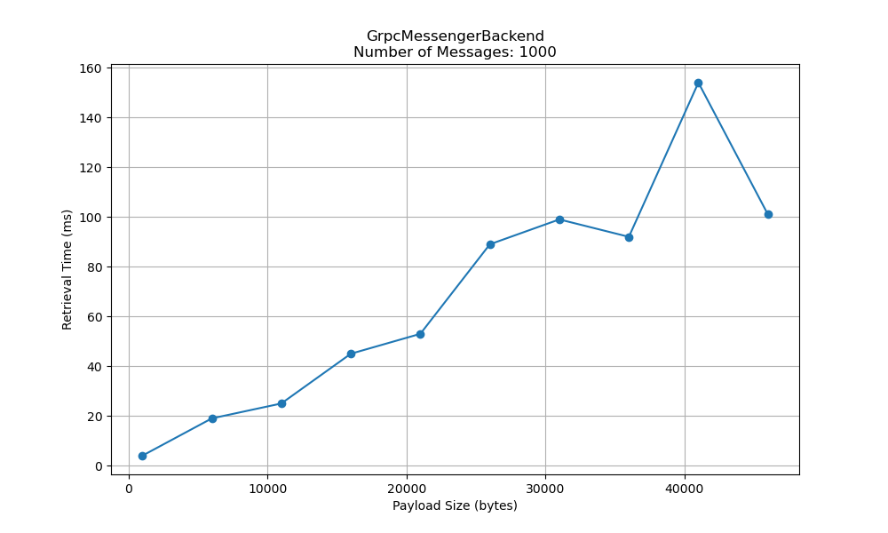
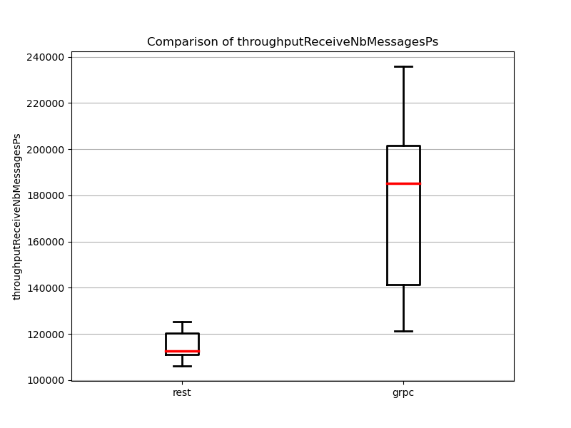
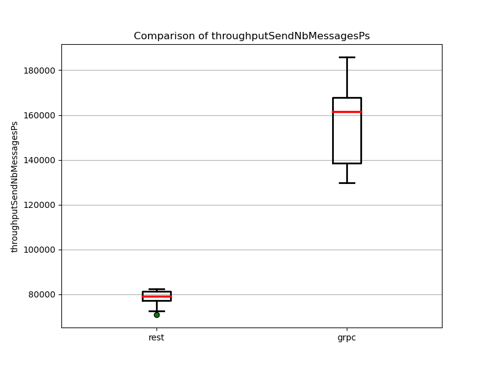
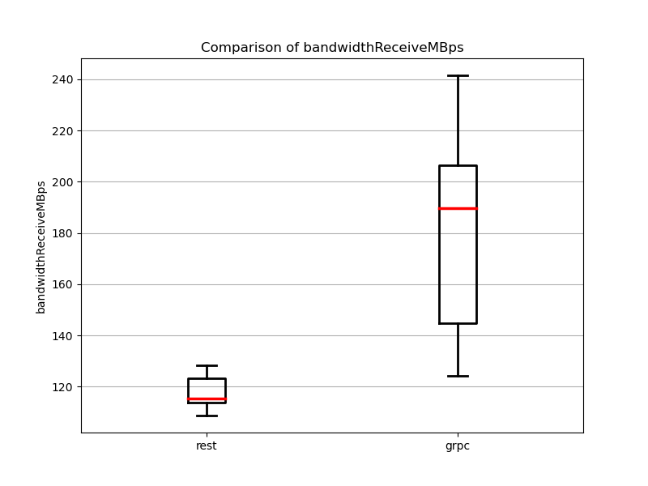

# ADS Assignment 1: Services

This repository contains the LaTeX source code for **"ADS Assignment 1: Services"**, which focuses on the design, implementation, and evaluation of a message management system using REST and gRPC technologies. The document highlights the system architecture, REST and gRPC service interfaces, and performance comparisons between the two technologies.

## Table of Contents

- [ADS Assignment 1: Services](#ads-assignment-1-services)
  - [Table of Contents](#table-of-contents)
  - [1. Introduction ](#1-introduction-)
  - [2. System Design ](#2-system-design-)
    - [REST Service Interface ](#rest-service-interface-)
    - [gRPC Service Interface ](#grpc-service-interface-)
  - [3. Service Implementation ](#3-service-implementation-)
    - [RESTful Web Service Implementation ](#restful-web-service-implementation-)
    - [gRPC Implementation ](#grpc-implementation-)
  - [4. Testing and Performance Evaluation ](#4-testing-and-performance-evaluation-)
    - [Logic Test Plans ](#logic-test-plans-)
    - [Performance Test Cases and Results ](#performance-test-cases-and-results-)
      - [Batch vs. Sequential Message Processing](#batch-vs-sequential-message-processing)
      - [Scalability with Number of Messages](#scalability-with-number-of-messages)
      - [Impact of Message Size](#impact-of-message-size)
      - [Performance Metrics](#performance-metrics)
  - [5. Evaluation and Comparison ](#5-evaluation-and-comparison-)
    - [Implementation Complexity](#implementation-complexity)
    - [Communication Performance](#communication-performance)
  - [6. Conclusion ](#6-conclusion-)
  - [7. References ](#7-references-)

---

## 1. Introduction <a name="introduction"></a>

This report presents the design, implementation, and evaluation of a message management system built using two different service-oriented technologies: RESTful web services and gRPC. The objective is to explore the interoperability, implementation complexity, and communication performance of each technology.

---

## 2. System Design <a name="system-design"></a>

The system is designed around a service interface called `Messenger`, which allows developers to manage messages in a topic-based subscription model. The key functionalities include storing, retrieving, deleting messages.

There are two services that use different protocols to manage the distribution of the messenger data:

- **REST:** The REST service uses HTTP and JSON to transmit data, following a stateless communication model. It is easy to implement and widely supported but can introduce overhead due to the verbose nature of JSON.
- **gRPC:** The gRPC service uses Protocol Buffers (Protobuf) for efficient, compact data serialization. It supports HTTP/2 and bi-directional streaming.

### REST Service Interface <a name="rest-service-interface"></a>

The REST API provides the following endpoints:

| **Method** | **Endpoint**                          | **Request Body**     | **Response**    |
|------------|---------------------------------------|----------------------|-----------------|
| POST       | `/api/messenger`                      | `Message`            |                 |
| POST       | `/api/messenger/batch`                | `Message[]`          |                 |
| GET        | `/api/messenger/{id}`                 |                      | `Message`       |
| POST       | `/api/messenger/batch/retrieve`       | `MessageId[]`        | `Message[]`     |
| DELETE     | `/api/messenger/delete`               | `MessageId`          |                 |
| DELETE     | `/api/messenger/batch/delete`         | `MessageId[]`        |                 |
| POST       | `/api/messenger/subscribe`            | `SubscriptionRequest`| `Topic[]`       |
| POST       | `/api/messenger/unsubscribe`          | `SubscriptionRequest`| `Topic[]`       |
| GET        | `/api/messenger/users`                |                      | `Username[]`    |
| GET        | `/api/messenger/topics`               |                      | `Topic[]`       |
| POST       | `/api/messenger/topics/{username}`    | `Username`           | `Topic[]`       |
| POST       | `/api/messenger/subscribers`          | `Topic`              | `Username[]`    |
| POST       | `/api/messenger/message/user/{username}` | `Username`          | `MessageId[]`   |
| POST       | `/api/messenger/message/topic`        | `Topic`              | `MessageId[]`   |

**Notes:**

- `{id}` and `{username}` are path variables representing the message ID and username, respectively.
- `SubscriptionRequest = {username, topic}`
- All request and response bodies are in JSON format.

### gRPC Service Interface <a name="grpc-service-interface"></a>

The gRPC service `Messenger` provides the following RPC methods:

| **Method**             | **Request**           | **Response**          | **Description**                                                      |
|------------------------|-----------------------|-----------------------|----------------------------------------------------------------------|
| `StoreMessage`         | `Message`             | `Empty`               | Stores a single message.                                             |
| `Store`                | `MessageBatch`        | `Empty`               | Stores multiple messages in a batch.                                 |
| `RetrieveMessage`      | `MessageId`           | `Message`             | Retrieves a message by its ID.                                       |
| `RetrieveMessages`     | `MessageIdBatch`      | `MessageBatch`        | Retrieves multiple messages by their IDs.                            |
| `DeleteMessage`        | `MessageId`           | `Empty`               | Deletes a message by its ID.                                         |
| `DeleteMessages`       | `MessageIdBatch`      | `Empty`               | Deletes multiple messages by their IDs.                              |
| `Subscribe`            | `SubscribeRequest`    | `TopicBatch`          | Subscribes a user to a topic. Returns the list of topics subscribed. |
| `Unsubscribe`          | `SubscribeRequest`    | `TopicBatch`          | Unsubscribes a user from a topic. Returns the list of topics.        |
| `ListUser`             | `Empty`               | `UsernameBatch`       | Retrieves a list of all users.                                       |
| `ListTopic`            | `Empty`               | `TopicBatch`          | Retrieves a list of all topics.                                      |
| `ListTopicByUser`      | `Username`            | `TopicBatch`          | Retrieves topics subscribed by a user.                               |
| `ListSubscriber`       | `Topic`               | `UsernameBatch`       | Retrieves subscribers of a topic.                                    |
| `ListMessageByUser`    | `Username`            | `MessageIdBatch`      | Retrieves message IDs sent by a user.                                |
| `ListMessageByTopic`   | `Topic`               | `MessageIdBatch`      | Retrieves message IDs in a topic.                                    |

---

## 3. Service Implementation <a name="service-implementation"></a>

### RESTful Web Service Implementation <a name="restful-web-service-implementation"></a>

The RESTful services were implemented using the **Spring Boot** framework. Each method of the `Messenger` interface was exposed as a REST API endpoint, utilizing HTTP methods such as `GET`, `POST`, `DELETE`, etc. Spring Boot simplifies the process of building RESTful APIs by providing built-in features for routing, request handling, and Java object serialization.

### gRPC Implementation <a name="grpc-implementation"></a>

The gRPC service was implemented using **Protocol Buffers (Protobuf)** to define the service contract. Each method of the `Messenger` interface was mapped to a corresponding gRPC service method. Below is an example of how the message conversion is handled between client-server communication:

```java
private MessengerOuterClass.Message convertMessage(Message message) {
    return MessengerOuterClass.Message.newBuilder()
        .setId(MessengerOuterClass.MessageId.newBuilder()
            .setValue(message.getId().getValue()).build())
        .setTimestamp(MessengerOuterClass.Timestamp.newBuilder()
            .setValue(message.getTimestamp().getValue()).build())
        ...
        .build();
}

private Message convertRpcMessage(MessengerOuterClass.Message message) {
    return new Message(
        new MessageId(message.getId().getValue()), 
        new Timestamp(message.getTimestamp().getValue()), 
        new Username(message.getUsername().getValue()), 
        new Topic(message.getTopic().getValue()), 
        new Content(message.getContent().getValue()), 
        new Data(message.getData().getValue().toByteArray())
    );
}
```
## 4. Testing and Performance Evaluation <a name="testing-and-performance-evaluation"></a>

### Logic Test Plans <a name="logic-test-plans"></a>

The following automated test cases were implemented:

1. **Test storing and deleting a message**: Ensures that storing a message increases the message count and deleting decreases it.
2. **Test storing and deleting multiple messages**: Verifies that storing and deleting multiple messages works correctly and updates the message count accordingly.
3. **Test storing and retrieving a message**: Checks that a stored message can be retrieved correctly.
4. **Test storing and retrieving multiple messages**: Confirms that all stored messages can be retrieved properly.
5. **Test subscribing and unsubscribing**: Verifies that subscribing to a topic increases the user's subscription count, and unsubscribing decreases it.
6. **Test wildcards in topics**: Ensures correct subscription and unsubscription when wildcards are used in topic names.
7. **Test clearing all messages of a user**: Verifies that all messages from a specific user can be deleted.
8. **Test clearing all messages of a topic**: Confirms that all messages associated with a specific topic can be deleted.
9. **Test clearing all messages**: Verifies that all messages in the system can be deleted to reset the system state.

### Performance Test Cases and Results <a name="performance-test-cases-and-results"></a>

#### Batch vs. Sequential Message Processing

Batch processing demonstrated significant performance gains over sequential processing in both REST and gRPC implementations.

- **REST**: Sequential vs. Batch Retrieval Time

    

- **gRPC**: Sequential vs. Batch Retrieval Time

    

**Interpretation**: Batch processing reduces network overhead by combining multiple messages into a single request. This is especially beneficial in gRPC due to its efficient binary protocols and streaming capabilities, which outperform REST's JSON-based model.

#### Scalability with Number of Messages

As the number of messages increased, gRPC maintained better throughput and lower retrieval times compared to REST.

- **REST**: Retrieval Time vs. Number of Messages

    

- **gRPC**: Retrieval Time vs. Number of Messages

    

**Interpretation**: gRPC's use of HTTP/2, which supports multiplexing and header compression, allows it to handle an increasing number of messages with lower latency compared to REST.

#### Impact of Message Size

gRPC showed more efficient handling of larger messages compared to REST, owing to Protocol Buffers' compact binary format.

- **REST**: Retrieval Time vs. Payload Size

    

- **gRPC**: Retrieval Time vs. Payload Size

    

**Interpretation**: gRPC's binary serialization with Protocol Buffers results in smaller message sizes compared to REST's JSON format, making gRPC more efficient with larger payloads.

#### Performance Metrics

- **Throughput Received Comparison**: Number of messages received per second for REST and gRPC.

    

- **Throughput Sent Comparison**: Number of messages sent per second for REST and gRPC.

    

- **Bandwidth Usage Comparison**: Bandwidth used during message retrieval operations.

    

**Interpretation**: gRPC shows higher throughput compared to REST due to efficient serialization, and higher bandwidth usage due to the increased number of messages being transmitted.

---

## 5. Evaluation and Comparison <a name="evaluation-and-comparison"></a>

### Implementation Complexity

- **REST**: Easier to implement and widely supported, with a simpler setup using HTTP and JSON. Familiarity with standard HTTP verbs and data formats reduces development complexity.
- **gRPC**: More complex to implement due to the need for Protocol Buffers and code generation from `.proto` files. Additional challenges may arise with firewall configurations due to HTTP/2 usage.

### Communication Performance

gRPC demonstrated superior performance in terms of throughput and latency, particularly for large numbers of messages or larger payloads. The efficient serialization and HTTP/2 features like multiplexing and server push make gRPC faster and more efficient than REST.

---

## 6. Conclusion <a name="conclusion"></a>

In this assignment, we implemented a message management system using both REST and gRPC technologies, highlighting their respective strengths and weaknesses:

- **REST**: Simpler to implement and more universally compatible, but slower due to higher latency and bandwidth usage.
- **gRPC**: Offers better performance, particularly with large payloads and numerous messages, but comes with added complexity and potential configuration challenges.

The choice between REST and gRPC depends on project needs—REST is suitable for simple, rapid development, while gRPC is ideal for performance-critical applications where complexity is manageable.

---

## 7. References <a name="references"></a>

- [REST Web Services](https://en.wikipedia.org/wiki/REST)
- [gRPC](https://en.wikipedia.org/wiki/GRPC)
- [Protocol Buffers](https://en.wikipedia.org/wiki/Protocol_Buffers)
